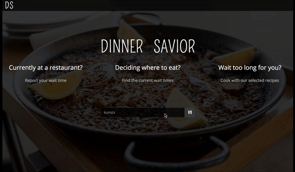
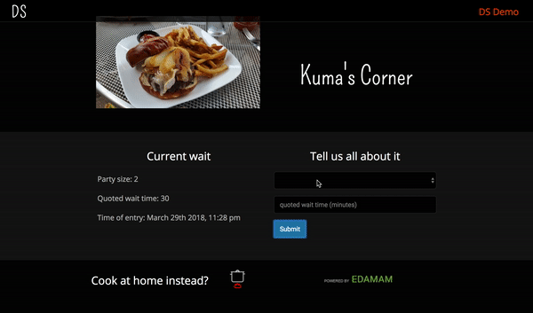

# [Dinner-Savior](https://quangao.github.io/dinner-savior/)

## * A firebase powered web application that allows users report/access wait time at a restaurant in real time.

## * If you decide it is not worth the wait, we offer you three hand picked recipes to cook at home according to the types of restaurants you searched for.

### Search any restaurants => Select the correct one => Check out wait time

### Report the newest wait time at popular restaurants => If not happy with the wait, get recipes to cook at home

### You might think, oh, it is like Waze but for restaurants! You are exactly right! We rely on our users to obtain the most up-to-date data and share it with the rest of the community to help you make informed decisions.

